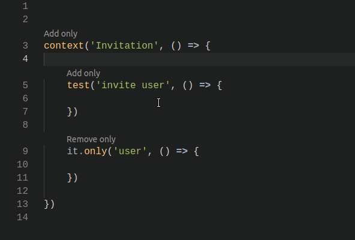

## Overview

Add and remove `.only` near `describe`, `context`, `it`, `test` easily using CodeLens

## Demo

## Contribute

Please feel free to fork, improve, make pull requests or fill issues.
I'll be glad to fix bugs you encountered or improve the extension.
